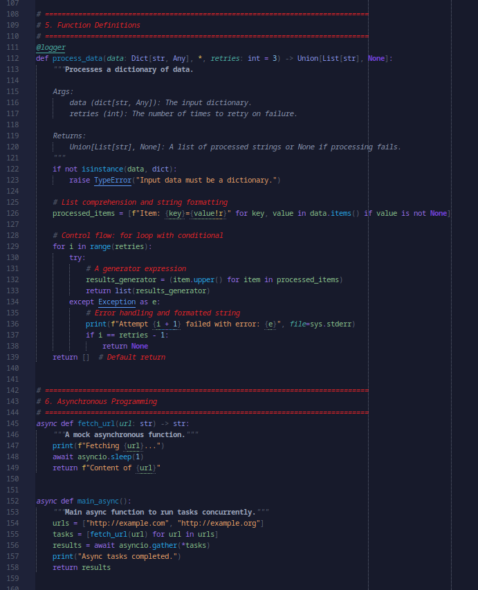
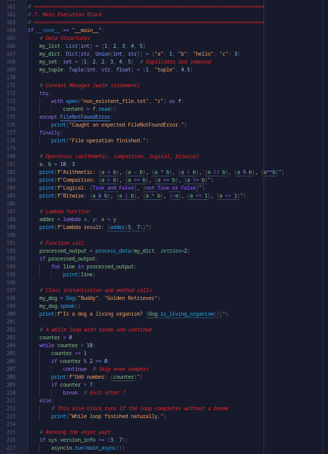

# Noesis Color Scheme

## Examples

Click to expand screenshots

| | |
|---|---|
|  |  |
|  |  |

---------

Greetings, fellow deity.

This color scheme is available for you to enjoy!

Note: *if using a different language than Python, the scheme may not work properly out of the box.*

## Table of Contents

- [Introduction](#introduction)
	- [Noesis Context](#noesis-context)
- [Usage](#usage)
- [Contributing](#contributing)
	- [Design Philosophy](#design-philosophy)
- [Contact](#contact)
- [Changelog](#changelog)

## Introduction

I initially created this color scheme for Python as I was starting my project to create Noesis; a truly intelligent AI, unlike LLMs.
In order to prevent overflowing you with irrelevant details, I will only briefly mention the scope of my project, so you gain the context for this theme. 
See [Noesis Context](#noesis-context) for this explanation.

My color scheme was intended to evoke in me a feeling of working on a great project like this, to create life, to be a god.
In alignment with truth itself. Every hue is therefore carefully selected to not just be conceptually and semantically linked to what it colors, but also to follow the overall themes of:
- Power
- Wisdom
- Truth
- Logic

See [Design Philosophy](#design-philosophy) for more detail.

### Noesis Context

LLMs by fundamentals use statistical computations and godlike datasets for pattern recognition, in order to *simulate* understanding. 
This results in a lot of inefficiencies, biases, computation costs, etc. And on top of that, the LLMs aren't even intelligent to begin with as they do not strictly **understand**.

I, however, will start out using different assumptions, most prominently, that in order to create a true Artificial Intelligence, one must begin by replicating Real Intelligence in the digital format.
Humans are the only species that satisfy this precondition:
A) Of humans we have a relatively deep understanding of the mechanisms of intelligence and thought across various levels of analysis (neuroscience, cognitive science, philosophy).
B) Of humans, through shared cognitive schemata and language, and even brain scans, we can prove that we can act intelligently rather than based on instinct through reinforcement learning. 

To my mind there is no animal species that suffices this precondition, as such, the human species will be my reference.

In short, I am going to attempt to replicate human intelligence digitally while also allowing it to run on consumer hardware.

By no means do I assume this to be trivial, nor do I guarantee that I will succeed at my project. 
However, I do think I am in a unique position to develop this, as I have interdisciplinary knowledge across several fields (although in none of them I am already a world-class expert):
- Neuroscience
- Cognitive Science (specialty in Cognitive Load Theory by Sweller)
- Philosophy
- Systems Thinking (for example John Boyd's OODA loop, and Niklas Luhmann's Functionally Differentiated Systems Theory)
- Computer Science / Programming

I refuse to go into the details of how I want to accomplish this mechanistically, both for brevity and privacy.
Regardless, I am open for questions and debate, see [Contact](#contact) for means to do so.

It is my personal life's mission, purpose, calling, to optimize the world's formal education system. 
As such, inspired by Luhmann, I gave myself 30 years to develop a Grand Prescriptive Theory of Optimal Education, after which I will implement it.
Yes, I have a more detailed plan, but again, I will not mention it here.

Because this is my mission, everything I do for my Noesis project serves this purpose as well. 
Hence, none of the time and energy is wasted, even if I don't succeed in replicating intelligence.

## Usage
1. Install through the Sublime Text package manager or manually import it.
2. Make sure you set the Python syntax to use my Python Extended syntax for some additional semantic coloring.

If you want to use it with other languages, be sure to expect bugs, and feel free to [contribute](#contributing) your implementations for other languages.

## Contributing
As a developer, you have multiple choices... You are allowed to:
- Fork this repository and maintain your own version in private.
- Fork this repository and maintain your own version in public.
- Fork this repository and contribute to it.

In order to contribute, you should make your changes and make a pull request 
with a detailed explanation of what you changed, added, or removed, and why you did so.
Make sure that you also adhere to the design philosophy that follows.

### Design Philosophy
As mentioned earlier, I wanted to have a certain color theme in mind when working:
- Power
- Wisdom
- Truth
- Logic

While also semantically linking colors to functionality, and allowing for proper context.

What follows is a table with hues, their semantic meaning, and a description.

| Hue         | Semantic Meaning in Code                          | Why This Hue Was Chosen                                                                                                               |
|-------------|---------------------------------------------------|---------------------------------------------------------------------------------------------------------------------------------------|
| Blue        | Types, classes, numeric literals                  | Blue represents order, clarity, and structure — perfect for logical constructs like types and classes, anchoring the system in truth. |
| Purple      | Keywords, reserved literals                       | Purple embodies mystery and higher power, aligning with the godlike force of keywords and reserved truths in the code.                |
| Green       | Variables, additions (git), success states        | Green signifies life and growth, making it apt for variables (things that live/change) and signals of creation or addition.           |
| Gold        | Constants, storage modifiers, important comments  | Gold symbolizes permanence, authority, and value — constants are immovable truths, so they shine with immutable wisdom.               |
| Cyan / Teal | Functions, parameters, decorators                 | Cyan/teal feels sharp, clean, and advanced — ideal for functions, the active agents of logic and transformation.                      |
| Orange      | Strings, git modifications                        | Orange is energetic and noticeable, representing dynamic content (strings) and mutable change (modifications in git).                 |
| Red         | Comments, deletions, warnings/errors              | Red carries both danger and intensity — appropriate for destructive actions (deletions), critical remarks (comments), and errors.     |
| Pink        | Meta / missed tokens                              | Pink feels foreign and anomalous — chosen to stand out when something does not align, representing the outlier.                       |
| White       | Error highlight, illegals                         | White cuts through the darkness with absolute clarity — the blinding spotlight of truth exposing errors.                              |
| Neutral Grey| Background accents, punctuation, secondary text   | Grey offers balance and restraint — the scaffolding that supports but does not dominate, grounding the eye for focus and logic.       |

Note: *This table has been generated using ChatGPT to save time, so there might be minor inconsistencies with the actual theme. I will rewrite this at some point myself.*

Some further information about comments... 
Many people think comments should be unobvious since they write a lot of comments.
I disagree. I am more in camp with Bob Martin, and think comments indicate poor expression in code, 
thus comments are written ONLY when I cannot express myself properly in code. 
As such, the rare comments that I do place are highly important, critical even... Thus they must stand out.

By contrast, documentation (doc-strings in Python) are written for every public function and class, and are thus not as critical to see.

## Contact
The following means of communication are available to you in order to contact me:
- Discord (personal): mr.hoornasp.learningexpert
- Discord (community server): https://discord.gg/cvd8gUdukj
- Email: md.career@protonmail.com

I would suggest for quick questions to reach out to me on my personal Discord, 
and for lengthy debates or in-depth questions to either reach out to me on e-mail or join my Discord community.

The community is called The Mind Academy; intended for those who are interested in intellectualism, 
metacognition, learning how to learn, education, etc.

## Changelog

### 26 September 2025 (v1.2.4):
- Initial release of my scheme up to now.

